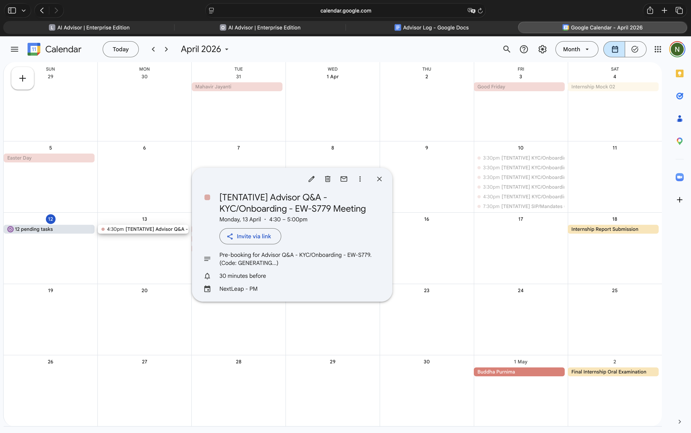
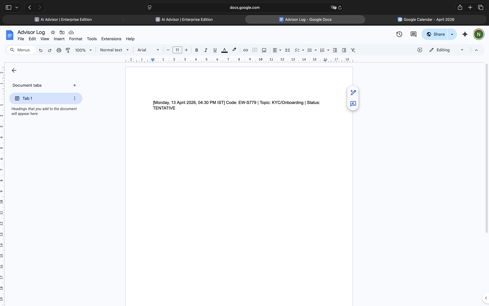
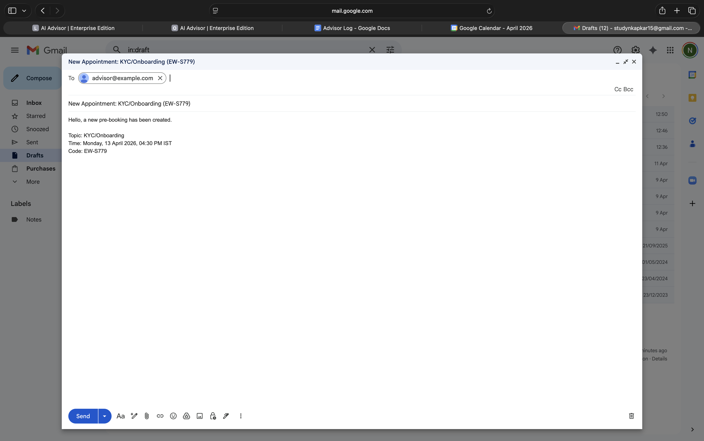

# Multi-Agent Advisor Appointment Orchestrator

🎥 **[Watch Demo Video](https://drive.google.com/file/d/1wMl33KIjYXsvH4dZVDsREQHh7mqW_p_H/view?usp=sharing)** | 🌐 **[Live Prototype](https://multi-agent-appointment-orchestrator.onrender.com)**

A high-performance, voice-enabled AI agent designed for financial advisor scheduling. This system combines robust NLU intent detection with real-world tool integration (Google Calendar, Google Docs, Gmail) while maintaining strict legal and PII compliance.

## 🚀 Key Features

- **Voice-First Experience**: Built-in speech-to-text and text-to-speech using ElevenLabs and Web Speech API.
- **MCP Tool Engine**: Automated side-effects including:
  - **Google Calendar**: Creating tentative holds.
  - **Google Docs**: Logging pre-bookings and waitlists.
  - **Gmail**: Drafting approval emails for advisors.
- **Compliance Architecture**: 
  - **PII Protection**: Scans and refuses collection of emails/phone numbers in the conversation.
  - **Investment Advice Refusal**: Automatically detects and redirects investment advice requests to educational resources (Investopedia).
- **Intelligent Waitlisting**: Phase 5 logic handles "full calendar" scenarios by offering priority waitlist spots.
- **5-Intent NLU**: Handles `book_new`, `reschedule`, `cancel`, `guidance`, and `check_availability`.

## 🏗️ Technical Architecture

### The NLU Engine (Groq + Llama 3.3)
The system uses a state-of-the-art Llama model via Groq for sub-millisecond intent classification and slot filling. It maps user utterances into structured JSON for the orchestrator.

### Mock vs. Real Calendar Logic
While the current production version integrates with the **Google Calendar API** via MCP, we maintain a robust "Mock Logic" structure as per the architectural brief:
- **Mock Service**: Generates slots based on "top-of-hour" gaps (10 AM, 11 AM, 2 PM, 3 PM).
- **Conflict Resolution**: Even in mock mode, it simulates a "busy" calendar by checking against existing events to prevent double bookings.
- **IST Handling**: All slots are processed in UTC but displayed in Indian Standard Time (IST) for consistency.

## 🛠️ Setup Instructions

1. **Clone the Repo**:
   ```bash
   git clone <your-repo-link>
   cd multi-agent-appointment-orchestrator
   ```

2. **Environment Variables**:
   Create a `.env` file in the `production/` directory:
   ```env
   GROQ_API_KEY=your_key_here
   ELEVENLABS_API_KEY=your_key_here
   LOG_DOC_ID=your_google_doc_id
   ```

3. **Google API Setup**:
   - Place your `credentials.json` in the `production/` folder.
   - Run the app once locally to generate `token.json` via the OAuth flow.

4. **Install Dependencies**:
   ```bash
   pip install -r requirements.txt
   ```

5. **Run the Server**:
   ```bash
   python production/server.py
   ```

## 🌐 Deployment

This application is ready for deployment on **Render** or **Railway**. 
- **Web Service**: Runs `server.py` using Uvicorn.
- **Environment**: Ensure all API keys are set in the deployment dashboard.
- **Static Files**: Serves the frontend from the `static/` directory.

## 🎙️ Official Demo Script (Used for Recording)

**Voiceover/Prompt Sequence:**
1.  **User**: "Hello" 
2.  **Bot**: *(Disclaimer text)*
3.  **User**: "Yes"
4.  **Bot**: *(Asks for topic)*
5.  **User**: "I want to book an appointment for KYC on boarding"
6.  **Bot**: *(Offers Monday slots)*
7.  **User**: "Second"
8.  **Bot**: *(Confirms 4:30 PM slot)*
9.  **User**: "Yes go ahead"
10. **Bot**: "Confirmed! Your code is **EW-S779**..."
11. **User**: "My phone number is 1234567890" (PII Rejection Test)
12. **Bot**: "I'm sorry... please do not share personal details..." (Compliance Success)

---

## 📅 Submission Artifacts (Evidence)

### 1. Google Calendar Hold
**Title**: `[TENTATIVE] Advisor Q&A - KYC/Onboarding - EW-S779`
**Logic**: Created via `calendar_create_hold` tool.


### 2. Google Doc Entry (Advisor Pre-Bookings)
**Actual Text Appended**:
```
[Monday, 13 April 2026, 04:30 PM IST] Code: EW-S779 | Topic: KYC/Onboarding | Status: TENTATIVE
```


### 3. Gmail Email Draft
**Subject**: `New Appointment: KYC/Onboarding (EW-S779)`
**Body**: 
> Hello, a new pre-booking has been created.
> Topic: KYC/Onboarding
> Time: Monday, 13 April 2026, 04:30 PM IST
> Code: EW-S779


---

## ⚙️ MCP Skills & Resilience
- **W9 Voice Skills**: Handled confirmation, IST timezone repetition, and short, crisp responses.
- **W5 Multi-Agent**: Synchronized data between Calendar, Docs, and Gmail using MCP tools.
- **W2 Compliance**: Automated disclaimer delivery and PII rejection.
- **W4 Slot-Filling**: Greedy extraction of topic + time window from natural language.

---
**Disclaimer**: This is a graduation project built for the AI Bootcamp. It demonstrates non-advice-giving AI orchestration for financial advisors.
